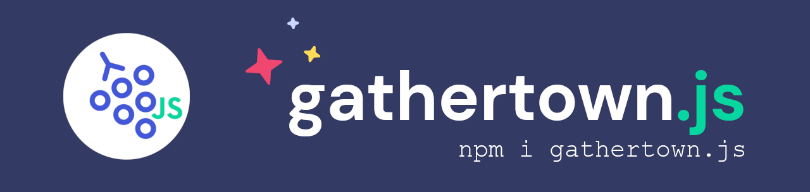

# GatherTownJS [](https://openbase.com/js/gathertown.js?utm_source=embedded&amp;utm_medium=badge&amp;utm_campaign=rate-badge)

[](https://github.com/warengonzaga) [](https://github.com/warengonzaga/gathertown.js/releases) [](https://github.com/warengonzaga/gathertown.js/stargazers)  [](https://github.com/warengonzaga/gathertown.js/blob/main/license)

[](https://gathertown.js.org)

Simple and lightweight **community contributed unofficial JavaScript/Typescript SDK** for [Gather Town](http://gather.town)'s HTTPS and WebSocket APIs. 🌏🕹💬

## ⚡ Features

Currently it supports **Gather HTTP API** `GET` and `POST` requests. We are currently working on **Gather Websocket API**.

### HTTP API (100% Coverage)

- `GET getMap()`
- `GET getEmailGuestList()`
- `POST createSpace()`
- `POST setEmailGuestlist()`
- `POST setMap()`

> NOTE: Currently working on Websocket API support as suggested by the team at Gather. Check out the discussion here: [#10](https://github.com/WarenGonzaga/gathertown.js/issues/10) and [#11](https://github.com/WarenGonzaga/gathertown.js/issues/11).

## 📖 Documentation

The complete documentation can be found here:

[](https://docs.warengonzaga.com/gathertownjs)

## 🕹️ Usage

Example usage of the GatherTownJS.

```js
const GATHER = require('gathertown.js'); // add gather package
const access = require('./config.json'); // load your apikey
const gather = GATHER(access.key); // access keys

// some variables
const spaceId = 'space-id/space-name';
const mapId = 'map-name';

function map() {
  gather
    .getMap({ spaceId, mapId })
    .then((data) => console.log(data))
    .catch((err) => console.log(err));
}

map();
```

### ⚓ With Hooks

```js
const { useGather } = require('gathertown.js');
const access = require('./config.json'); // load your apikey

// some variables
const spaceId = 'space-id/space-name';
const mapId = 'map-name';

function map() {
  // load only needed functions
  const { getMap } = useGather(access.key);

  getMap({ spaceId, mapId })
    .then((data) => console.log(data))
    .catch((err) => console.log(err));
}

map();
```

## 🎯 Contributing

Contributions are welcome, create a pull request to this repo and I will review your code. Please consider to submit your pull request to the `dev` branch. Thank you!

Read the project's [contributing guide](./CONTRIBUTING.md) for more info.

## 💬 Discussions

For any questions, suggestions, ideas, or simply you want to share your experience in using this project, feel free to share and discuss it to the [community](https://github.com/warengonzaga/gathertown.js/discussions)!

## 🐛 Issues

If you're facing a problem in using GatherTownJS please let me know by [creating an issue here](https://github.com/warengonzaga/gathertown.js/issues/new). I'm here to help you!

## 🍀 Sponsors and Supporters

> Love what I do? Send me some [love](https://github.com/sponsors/warengonzaga) or [coffee](https://buymeacoff.ee/warengonzaga)!? 💖☕
>
> Can't send love or coffees? 😥 Nominate me for a **[GitHub Star](https://stars.github.com/nominate)** instead!
> Your support will help me to continue working on open-source projects like this. 🙏😇

## 📋 Code of Conduct

Read the project's [code of conduct](./CODE_OF_CONDUCT.md).

## 📃 License

GatherTownJS is licensed under [The MIT License](https://opensource.org/licenses/MIT).

## 📝 Author

GatherTownJS is created by **[Waren Gonzaga](https://github.com/warengonzaga)**, with the help of awesome [contributors](https://github.com/warengonzaga/gathertown.js/graphs/contributors).

[](https://github.com/warengonzaga/gathertown.js/graphs/contributors)

---

💻💖☕ by [Waren Gonzaga](https://warengonzaga.com) | [YHWH](https://youtu.be/9vh6Dz9oh8I?t=85) 🙏
